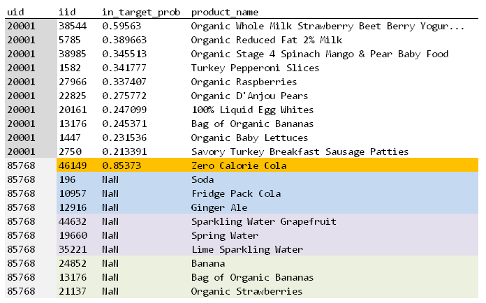
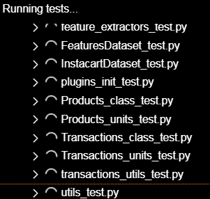
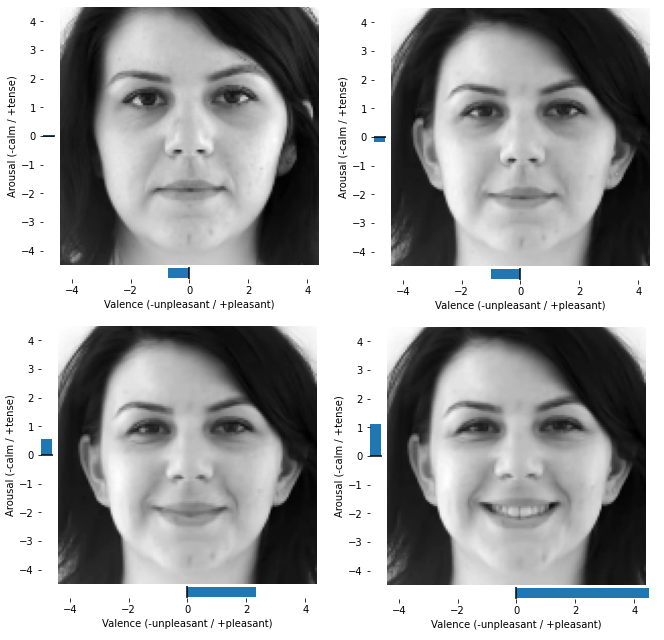
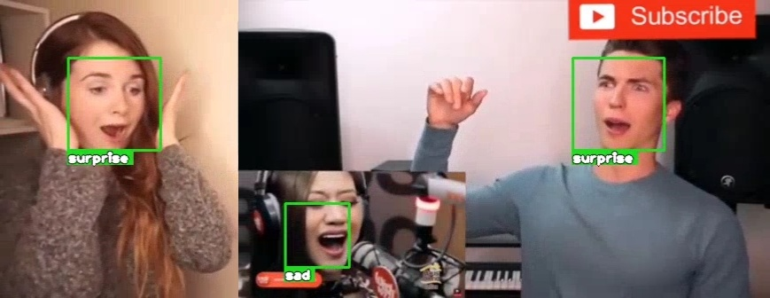
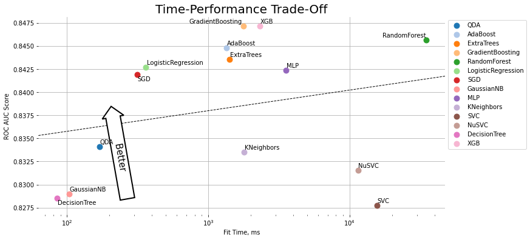
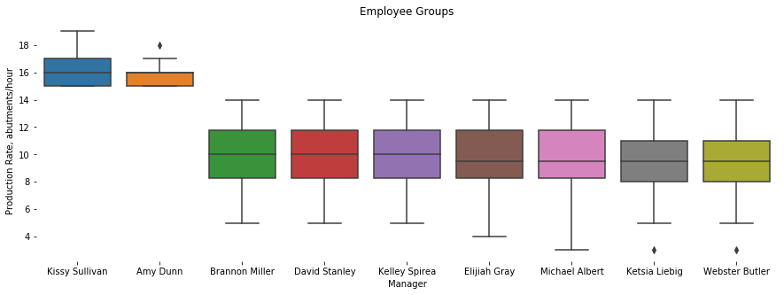

# Portfolio

*Data Science*

1. [Рекомендательная система для онлайн-гипермаркета Instacart](#rec-sys)
1. [Разработка программной библиотеки instacartlib на Python](#instacartlib)
1. [Обучение нейросети для распознавания выражения лица](#emotion-recognition)
1. [Система отслеживания эмоций с помощью веб-камеры](#webcam-emotion-recognition)
1. [Прогнозирование оттока на примере kaggle датасета Telco Customer Churn](#churn-prediction)
1. [Аналитика на примере kaggle датасета Human Resources DataSet](#hr-analysis)
1. [Обучение нейросетевой модели ИИ для консольной игры Ping-Pong](#pong-ai)

## Рекомендательная система для онлайн-гипермаркета Instacart

*2022-07*

* [github.com/d-01/graduate-2022-rec-sys](https://github.com/d-01/graduate-2022-rec-sys)
* [Видео-презентация](https://youtu.be/sa9garlNMqk) (10 минут) + оценка эксперта (2022-07-26)
* Проведено сравнение пяти различных моделей рекомендации товаров на транзакционных данных online-гипермаркета Instacart:
  1. Частотная модель (baseline)
  1. Коллаборативная фильтрация (implicit feedback)
  1. Генеративная нейросеть (TCN, Bai et al., 2018)
  1. Модель TIFU-KNN (arXiv:2006.00556)
  1. Бинарная классификация (feature engineering + CatBoostClassifier)
* Исходный датасет на kaggle: [Instacart Market Basket Analysis](https://www.kaggle.com/c/instacart-market-basket-analysis)
* Технологии: python, numpy, pandas, tensorflow, keras, sklearn, nbp, next basket prediction, map@k, mean average precision, tcn, temporal convolutional network, user embedding, implicit feedback, svd, als, tifu-knn, temporal item frequency user-based knn, pif, personalized item frequency, feature engineering, logistic regression, gbc, catboostclassifier

## Разработка программной библиотеки instacartlib на Python

*2022-07*

* [github.com/d-01/instacartlib](https://github.com/d-01/instacartlib)
* Программная библиотека на языке Python для генерации рекомендаций из транзакционных данных *Instacart dataset* ([kaggle.com](https://bit.ly/3e8PupT)).
* Позволяет обучать и использовать модель для предсказания списка из 10 товаров, которые пользователь с наибольшей вероятностью добавит в свой следующий заказ.
* Пример использования в Google Colab: [colab.research.google.com](https://colab.research.google.com/drive/1U7pC87mvlE4Q_9-mI4Y4sVxpKX96Tdtw?usp=sharing)
* Технологии: python, pytest, test coverage, tdd, git, pandas, sklearn, gbc, catboost, feature engineering

## Обучение нейросети для распознавания выражения лица

*2022-01*

* [github.com/d-01/graduate-2021-dec](https://github.com/d-01/graduate-2021-dec)
* [Видео-презентация](https://youtu.be/PNzgEXyk66s) (10 минут) + оценка эксперта (2022-01-17)
* В ходе выполнения работы обучена нейросеть для классификации изображений с лицами на 9 классов (9 эмоций).
* Также построены две регрессионные нейросетевые модели для предсказания эмоции в виде двух VA-координат (valence-arousal разложение).
* Процедура аугментации изображений встроена в нейросеть в виде кастомного входного keras слоя.
* Технологии: python, numpy, opencv, tensorflow, keras, cnn, mobilenet, imagenet, transfer learning, fine-tuning, data augmentation, image transformations, custom keras layer, fer, facial expression recognition, valence-arousal

## Система отслеживания эмоций с помощью веб-камеры

*2022-01*

* [github.com/d-01/webcam-emotion-recognition](https://github.com/d-01/webcam-emotion-recognition)
* Работает с веб-камерой, отслеживает положение лица и определяет эмоцию.
* Не требует установки, работает полностью в среде Google Colab ([открыть](https://colab.research.google.com/drive/1cvAZvsXXbZHi--QFNJDfTJEGB1JapKvo?usp=sharing)).
* Технологии: python, tensorflow, keras, opencv, cnn, mobilenet, fer, facial expression recognition, valence-arousal, face detection, dlib, google colab, javascript, html canvas

## Прогнозирование оттока на примере kaggle датасета Telco Customer Churn

*2021-03*

* [Открыть](https://d-01.github.io/static/jupyter-export/churn-prediction.html) Jupyter Notebook
* Сравнение 14 моделей прогнозирования оттока по качеству и производительности.
* Оригинальный датасет на kaggle: [Telco Customer Churn](https://www.kaggle.com/datasets/blastchar/telco-customer-churn)
* Технологии: ML, pandas, matplotlib, seaborn, sklearn, xgboost

## Аналитика на примере kaggle датасета Human Resources DataSet

*2020-07*

* [Открыть](https://d-01.github.io/static/jupyter-export/hr-analysis.html) Jupyter Notebook
* Аналитический отчет для HR-отдела с проверкой гипотез и рекомендациями по стратегии набора персонала и реорганизации текущей структуры команд.
* Оригинальный датасет на kaggle: [Human Resources Data Set](https://www.kaggle.com/datasets/rhuebner/human-resources-data-set)
* Технологии: pandas, matplotlib, seaborn, jupyter, postgresql

## Обучение нейросетевой модели ИИ для консольной игры Ping-Pong

*2021-09*

* [Открыть](https://d-01.github.io/static/jupyter-export/pong-ai.html) Jupyter Notebook
* Обучение нейросети для игры в ping-pong используя изображение с экрана (raw-pixel data).
* Технологии: RL, reinforcement learning, tensorflow, gym, Q-learning, DQN, replay buffer

